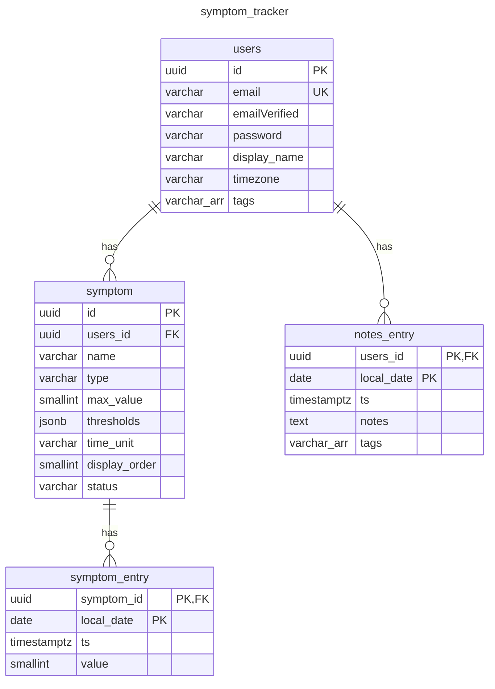

# symptom_tracker DB Schema

The purpose of this document is to explain the general structure of the symptom_tracker database and the architectural decisions behind it. This document is for anyone who is interested in understanding how the schema is designed and why. The four tables that will be discussed are: users, symptom, symptom_entry, notes_entry. I will not go into detail about every column, instead I will point out places where the design decision wasn’t always straightforward and important factors to note.

## users

I considered using the `SERIAL` pseudo-type for the `id` column for its smaller storage footprint. I also knew from the get-go that I wouldn’t be exposing the id in any URLs based on the design of Symptom Tracker. However, I decided to use `UUID` as I also knew that the user id would be referenced as a foreign key in other tables and would likely be referenced in API calls.

I decided to add the `timezone` column in consideration of the fact that people often travel and sometimes that travel falls outside their typical timezone. The worst case scenario that came to mind was someone traveling as far from their timezone as possible—enough for the day to change. I imagined a scenario where the user travels “forward” in time in which case there appears to be a “gap” in the data. I also considered a scenario where the user travels “backward” in time and their data could be overwritten. By storing the user’s timezone the date-based features that are key in the Symptom Tracker can follow the user’s local time, and the related data can be updated as needed. More on that later when reviewing the [symptom_entry](#symptom_entry) table.

The `tags` column is derived from the [notes_entry](#notes_entry) table, but I saw a need to compile the tags for simplicity in data visualization and data compilation. Anytime a user adds a note with a new tag, that tag will be added to the `users.tags` column. In this way we do not have to crawl through endless dates of notes for tags when we use them for data visualization.

The only column in this table that is optional and does not carry a constraint of `NOT NULL` is the `display_name`. Display name is not necessary but will enhance personalization in the UI.

## symptom

The symptom table has three columns (`type`, `time_unit`, `status`) that are of type `VARCHAR` which could have alternatively been of type `ENUM`. I think an `ENUM` type could have been simpler to use, but I decided to prioritize flexibility over ease of use. Currently each of these three columns requires a value check, and I’m not confident the possible values will not change as my understanding of what the users need changes. I think the flexibility of the four symptom types, for example, will allow the users to surprise me in the way they may choose to use them, in which case I may need to update their names to better reflect their usage. Additionally, I appreciate having the flexibility to migrate the database to one of a different type in the future and did not want to make that challenging by using `ENUM`.

I decided to use the `JSONB` type for the `thresholds` column given the storage, update, and usage pattern of the setting. The UX allows the users to update the moderate and strong threshold from a single UI. Currently there are no plans to make it possible to edit an individual threshold without considering the other for edit as well, since their values depend on each other. Strong cannot be less than moderate, for example. In this way, a JSON object really just made the most sense rather than having an individual column for each of the thresholds (including the defaults): mild, moderate, strong, severe.

Originally, I had added a symptoms column to the `users` table but later opted for adding the `display_order` column instead. I had thought to compile all symptoms, as I’m doing with tags, while keeping track of their order. In the end, I decided it wasn’t going to be beneficial to have a symptoms column as it will be necessary to query for the symptoms every time the Daily page loads, so I opted for the `display_order` column. This column is in anticipation of a future feature to allow users to reorder their symptoms.

The `users_id` column is a foreign key taken from the `users` table and will be used as an index to query for all the symptoms for a given user more easily.

As with the [users](#users) table and for the reason outlined above, I decided to use the `UUID` type for the `id` column.

## symptom_entry

This table has both a timestamp column, `ts`, and a `local_date` column. I hadn’t anticipated needing more than the `ts` column given the `users.timezone` column makes it possible to convert the timestamp to the user’s local time. However, I knew the data from symptom_entry would never be queried using an id as the Symptom Tracker UI tracks the data based on the date. An id column was never going to be used and would only serve to have a primary key in the table—a composite primary key was the only way to go. I’d initially thought I’d be able to make a composite key using `symptom.id` and `ts` converted to the users timezone, but Postgres doesn’t allow for expressions in a composite primary key. I considered using a unique index to solve this problem but then the table would still require a primary key.

In the end it was between having an unused id column or having both a timestamp and `local_date` column, and I decided having both `ts` and `local_date` is worth it. I have a source of truth for when an entry was updated,  I have a useful primary key that can still be updated when/if the user’s timezone changes, and `symptom_entry` has no id column.

This table almost ended up having two foreign keys, `symptom.id` and `users.id`. When I was still thinking through the possibility of a symptoms column on the users table, I had considered making `users.id` part of the composite primary key thinking I could skip querying for the symptom data using that column. Ultimately the decision to use the `symptom.display_order` column instead of a `users.symptoms` column led me to skip adding `users.id` to the `symptom_entry` table.

Without the `users.symptoms` column, the symptoms data (including `symptom.id`) is loaded upon initially loading the Daily page, anyway, and given each `symptom.id` is unique and implies a user, the `users.id` foreign key becomes redundant. I think this version of the primary key composed from just the `symptom.id` and the `local_date` accomplishes what the alternative would’ve and reduces the storage load on the database.

## notes_entry

Originally I considered storing the notes and related tags together with the symptom entries for a single day, as together they represent a single entry. However, the best data type for something like that would’ve been `JSONB`, but `JSONB` doesn’t make it easy to process data as it requires extracting what you need. So `notes_entry` it is.

The `notes_entry` table is similar to the [symptom_entry](#symptom_entry) table in that it will never be queried using an “id,” so a composite primary key makes more sense here. However, as notes are not tied to specific symptoms, this composite key is created using the `users.id` and `local_date` column. 

This table has both the `local_date` and `ts` columns for the reasons explained above for [symptom_entry](#symptom_entry).